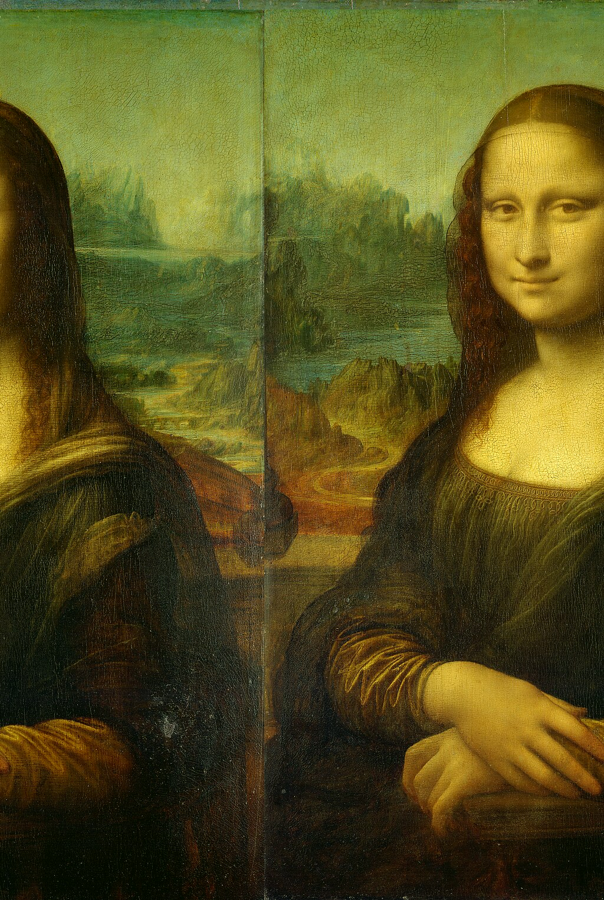

# Databending Demo

Here is the original file that I will databend throughout this demo.

Currently this file is a jpg. Lets try to bend it as a jpg first.

## Text Editor
First, I never want to operate on my original image, because it might break horribly.

1. Make a copy of the file.
  I'm going to do this with the command line, so `cp mona_lisa.jpg ex-1.txt`. Notice that I changed the file extension to a text file.

1. Open the file in a text editor. The default for your system works fine.

1. Try making some changes.
    - Copy/Paste some block of text. Save in your text editor.

1. Change back to an image
    - I used `cp ex-1.txt ex-1.jpg`, but you could do this with the file manager too.

1. Open that file in an image editor to see the result.
  

