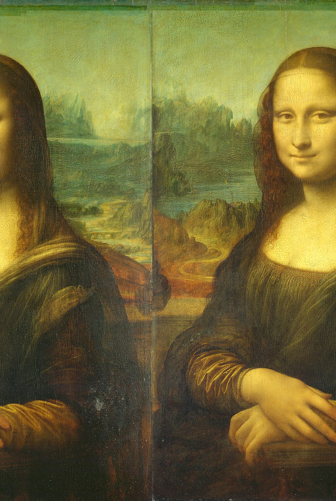

# Databending Demo

Here is the original file that I will databend throughout this demo.

Currently this file is a jpg. Lets try to bend it as a jpg first.

## Text Editor with JPGs
First, I never want to operate on my original image, because it might break horribly.

1. Make a copy of the file.
  I'm going to do this with the command line, so `cp mona_lisa.jpg ex-1.txt`. Notice that I changed the file extension to a text file.
1. Open the file in a text editor. The default for your system works fine.
1. Try making some changes.
    - Copy/Paste some block of text. Save in your text editor.
1. Change back to an image
    - I used `cp ex-1.txt ex-1.jpg`, but you could do this with the file manager too.
1. Open that file in an image editor to see the result.
  
1. Repeat until you get what you like!

I found JPGs easy to break, I got a lot of results that looked like this:

Being a little more strategic on what you are changing might help here.

## Text Editor and bmp
Bitmaps are more forgiving filetype to edit. Let's try one of those.

1. Convert image to a bitmap using imagemagick or something else.
    - `convert mona_lisa.jpg mona_lisa.bmp`
1. Copy to a text file.
    - `cp mona_lisa.bmp ex-2.txt`
1. Open the file in a text editor.
1. Try making some changes.
    - copy/paste blocks of code. Delete segments. Copy and paste a portion of another image.
1. Copy back to an image file.
    - `cp ex-2.txt ex-2.bmp`
1. Open the image file to preview your changes.
1. Repeat!

## Editing as hex
By working with the file as hex, we might get a better understanding of how a file type is structured. We can also be more surgical in our edits by working at the byte level.
This would work with any image type, but I'm going to stick with bmps for now.

1. Save a hex file of any image. 
    - `cp mona_lisa.bmp ex-2.bmp.hex`, notice I changed the file name and added a `.hex` extension.
1. Open this file in a hex editor. I'm using [sublime text](https://www.sublimetext.com/)
1. Now we see the hexadecimal representation of the file. Every two hex values represent one byte of data. i.e. `af06` is one byte.
    
1. Making changes to the values. 
    - All changes must still remain in hex. So you are limited to numbers 0-9 and characters a-f.
    - You can still copy and paste from one part of the file to another, or delete segments of bytes.
1. Remove the hex file extension
    - `cp ex-2.bmp.hex ex-2.bmp`, here I'm making a copy, so I can keep editing or undo changes I don't like.
1. Open the image file to preview the results.
1. Repeat!

Sometimes small changes have big results. Here I think I edited something near the top.

