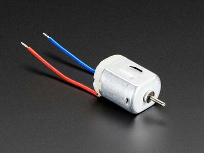
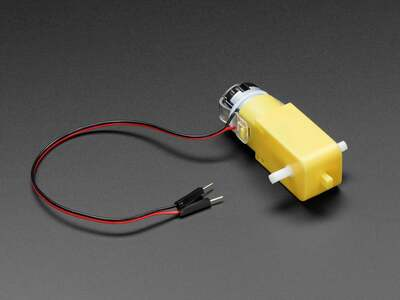
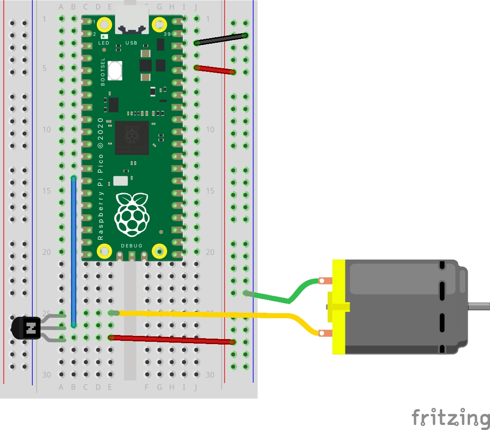

# DC Hobby Motor
Here is a guide to drive a DC motor with components you have. It is a little bit of a hack, explained later.

DC Motors are simple low power motors that rotate 360 continuously.

Here is a bare DC motor



Often they come with a gear box to give them more torque.



## Circuit
- Connect one gpio pin to the transistor base pin (middle pin) of a PN2222 transistor
- Connect the red cable of the motor to the transistor emitter pin (the third pin when looking at the flat side).
- Connect the black cable of the motor to the ground channel of the breadboard
- Connect a cable from the power channel of the breadboard to the collector pin of the transistor (first pin when looking at the flat side).



## Code
```python
# Run a DC motor from the Pico, the super hacky way.
import board
import digitalio

dc_switch = digitalio.DigitalInOut(board.GP10) # set any pin for output
dc_switch.direction = digitalio.Direction.OUTPUT

while True:
    dc_switch.value = True
```

# Explanation
The transistor is acting like a switch. When it receives a current to you the base pen it is open and will turn the motor on. 
When there is no current to the base, the gate is closed and the motor is off.

This is a hack. The more acceptable method is to connect the pico to an 'H bridge' circuit to control the motor.
This has several advantages; you can control the direction of rotation, speed, and connect motors that need way more power.
But this solution is simple and works OK with the parts you have.

# Resources
- [Adafruit Guide](https://learn.adafruit.com/use-dc-stepper-servo-motor-solenoid-rp2040-pico/dc-motors) - Shows the good way with a h bridge
- [H Bridge Circuit](https://www.adafruit.com/product/4489)

