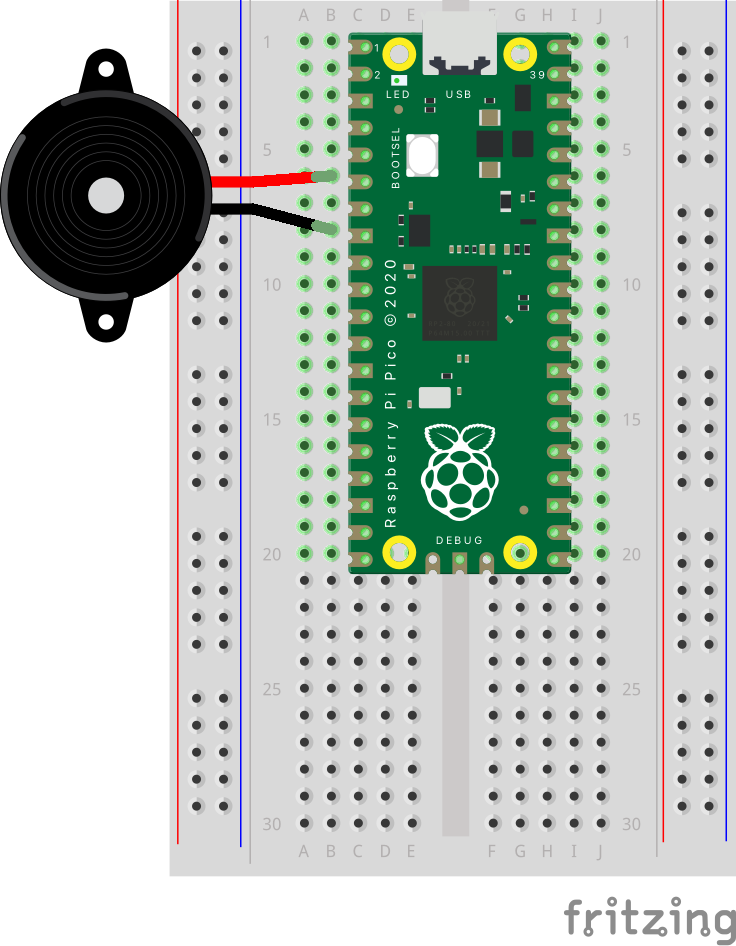

# Piezo Buzzer
A Piezo disk, like we used in the contacts mic, can also be used as a simple buzzer and can play different tones.

## Circuit
- Connect one leg of the piezo disk to GP5
- Connect one leg of the piezo disk to Ground

 
  
## Code
```python
import time

import board
import pwmio

# Define a list of tones/music notes to play.
TONE_FREQ = [
    262,  # C4
    294,  # D4
    330,  # E4
    349,  # F4
    392,  # G4
    440,  # A4
    494,  # B4
]

# Create piezo buzzer PWM output.
buzzer = pwmio.PWMOut(board.GP4, variable_frequency=True)
buzzer.duty_cycle = 2 ** 15
# led = pwmio.PWMOut(board.GP14, frequency=1000)

# Main loop will go through each tone in order up and down.
while True:
    # Play tones going from start to end of list.
    for i in range(len(TONE_FREQ)):
        buzzer.frequency = TONE_FREQ[i]
        time.sleep(0.5)  # Half second delay.
    # Then play tones going from end to start of list.
    for i in range(len(TONE_FREQ)-1, -1, -1):
        buzzer.frequency = TONE_FREQ[i]
        time.sleep(0.5)
```
