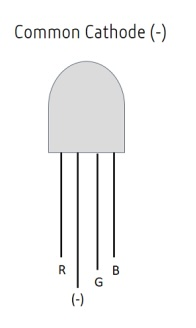
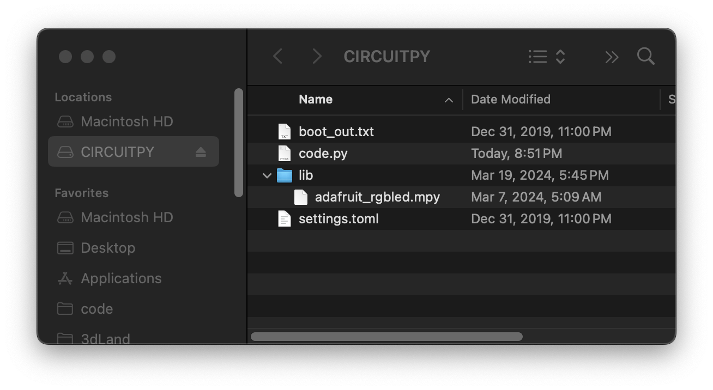
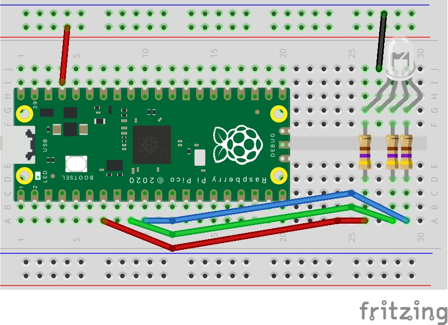

# RGB Led Instructions
A RGB led can be used to produce any color. 

There are 4 pins. Three pins for each color channel and one pin to connect to ground.


## Getting the Library
There is a adafruit library that makes it easier to control and RGB led. 
[Download bundle](https://circuitpython.org/libraries) and unzip.

Find the file `adafruit_rgbled.mpy` and copy it to the `lib` folder on the pico. This will restart the pico.



## Circuit
- Pins 5, 6, and 7 each get connected to a 470 ohm resistor.
- Resistors connect to the shorter legs on the LED.
  - Pin 5 to Red leg
  - Pin 6 to Green leg
  - Pin 7 to Blue Leg
- Long leg (cathode) gets connected to ground



## Code
Copy this code to Mu Editor.

```python
import board
import adafruit_rgbled

# Pin the Red LED is connected to
RED_LED = board.GP5

# Pin the Green LED is connected to
GREEN_LED = board.GP6

# Pin the Blue LED is connected to
BLUE_LED = board.GP7

# Create a RGB LED object
led = adafruit_rgbled.RGBLED(RED_LED, BLUE_LED, GREEN_LED)

while True:
    led.color = (107, 235, 52) #greenish blue
```

## Ideas
- You could cycle through colors by using a variable to control each color channel.
- Combine with other circuits like the potentiometer or button.
