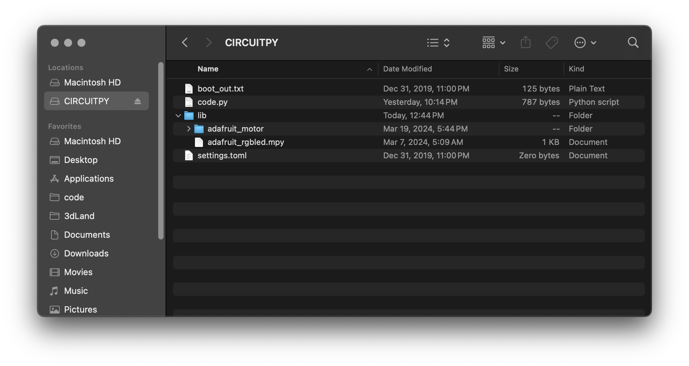
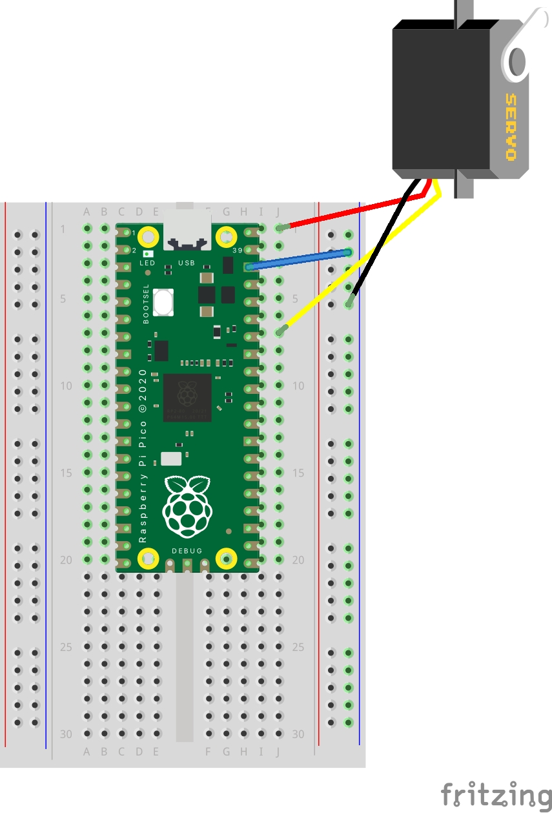

# Servo Motor
A servo motor is different from a DC motor because it can't turn all the way around. Instead it can sweep between 0 and 180 degrees. 
But it can be controlled to rotate to a specific angle and are fairly precise.

## Setup
You will need to add a new library to the pico. 

## Getting the Library
There is a adafruit library that makes it easier to control and RGB led. 
[Download bundle](https://circuitpython.org/libraries) and unzip.

Find the folder `adafruit_motor` and copy the entire folder to the `lib` folder on the pico. This will restart the pico.



## Circuit
- Red Servo cable (+) to 5V pin
- Black Servo cable (-) to ground
- Yellow Servo Cable to Pin 28



## Code

```python
import time
import board
from digitalio import DigitalInOut, Direction, Pull
import pwmio
from adafruit_motor import servo

print("servo test program")

# Servo setup
pwm_servo = pwmio.PWMOut(board.GP28, duty_cycle=2 ** 15, frequency=50)
servo1 = servo.Servo(
    pwm_servo, min_pulse=500, max_pulse=2200
)  # tune pulse for specific servo

# Two function definitions for servo tests

# Servo test
def servo_direct_test():
    print("servo test: 90")
    servo1.angle = 90
    time.sleep(2)
    print("servo test: 0")
    servo1.angle = 0
    time.sleep(2)
    print("servo test: 90")
    servo1.angle = 90
    time.sleep(2)
    print("servo test: 180")
    servo1.angle = 180
    time.sleep(2)
    
# Servo smooth test
def servo_smooth_test():
    print("servo smooth test: 180 - 0, -1º steps")
    for angle in range(180, 0, -1):  # 180 - 0 degrees, -1º at a time.
        servo1.angle = angle
        time.sleep(0.01)
    time.sleep(1)
    print("servo smooth test: 0 - 180, 1º steps")
    for angle in range(0, 180, 1):  # 0 - 180 degrees, 1º at a time.
        servo1.angle = angle
        time.sleep(0.01)
    time.sleep(1)
    
# main loop
while True:
    # uncomment to run a test
    servo_direct_test()
    #servo_smooth_test()

```

## Resources
- [Adafruit Tutorial](https://learn.adafruit.com/use-dc-stepper-servo-motor-solenoid-rp2040-pico/servo-motors)
